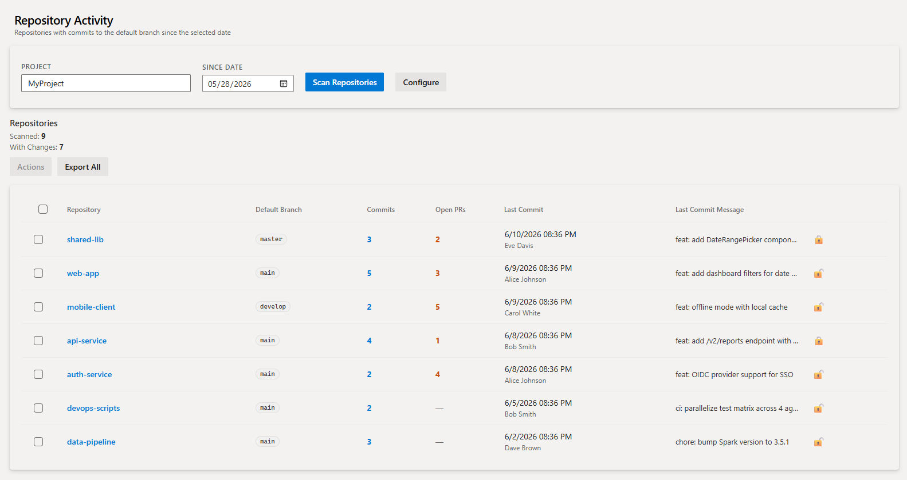
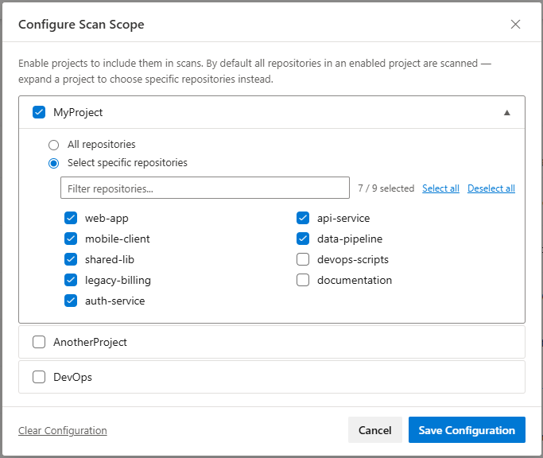
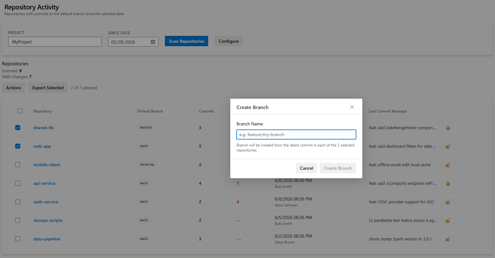

# Fulcrum Repository Activity

Adds a **Repo Activity** hub to the Azure Repos section. Instantly see which repositories have had commits to their default branch since any date you choose — and take bulk actions on the results.

## Scan Results

Enter a project name and a since-date, click **Scan Repositories**, and a sortable table appears showing every active repository with its commit count, open PR count, last commit date and author, and most recent commit message.

## Scan Scope Configuration

Click **Configure** to control exactly which projects and repositories are scanned. Enable any number of ADO projects and choose between scanning all repositories in a project or selecting a specific subset — useful when a project has hundreds of repositories and you only care about a few.

Saved configuration persists across sessions via the ADO extension data service.

## Bulk Actions

Select one or more rows to unlock the **Actions** menu:

- **Lock Repository** — sets `isLocked = true` on the default branch to block direct pushes.
- **Unlock Repository** — removes the lock.
- **Create Branch** — creates a new branch from the tip of the default branch across all selected repositories in one step, with conflict detection.

- **Export** — downloads a CSV of the selected rows (or all rows if nothing is selected), including a Project column for multi-project scans.
